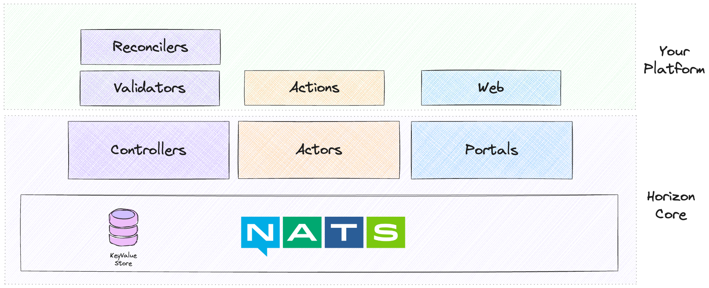

# Horizon 🌅 - Build your Internal Developer Platform

> Horizon provides essential building blocks and patterns for creating a minimal internal platform that enables developer self-service and autonomy.

## Why Horizon

We could not find something "simple" that would enable us to create self-service capabilities for development teams (or stream-aligned teams in Team Topologies lingo).

The common approach involves something like Kubernetes, CrossPlane and Backstage.
Even before you start doing anything, you have a complex stack of tools to maintain.
From experience we found gluing together tools with YAML on top of YAML leading to leaky abstractions and something that is difficult to learn, test and operate.

Horizon offers an alternative built on top of [NATS](https://nats.io/).
With Horizon you have to write code, and we have done this to get you in a product mindset from the beginning.
Don't expect a big ecosystem or lots of plugins you can install or lots of pretty graphs and UI elements: expect a thin layer on top of NATS to help you build only what you need.

## Architecture

### Core

The "core" consists of a NATS server and building blocks for creating your platform.

#### Controllers

Controllers are similar to Kubernetes controllers.
They allow you to write `Reconcilers` that perform reconcile loops on objects in the NATS Key Value (KV) store.
Reconcilers take an object specifiation and move the object towards the desired state of an object.

Controllers also implement `Validators` that validate objects as they are added to the KV store.
This is similar to Kubernetes' [Admission Controllers](https://kubernetes.io/docs/reference/access-authn-authz/admission-controllers/), but instead of config languages you write code to validate objects.

#### Actors

Actors enable you to write synchronous actions that operate on objects.
Actions do not require any persistence, but can interact with any persistence layer (like the NATS KV store).

Actors provide a broker mechanism for selecting an appropriate instance of an actor to run the action on.
For example, when scheduling a container you want it to run on a specific node.
Actors allow you to define an action such as `RunContainer` and the broker will ensure (based on label selection) that the relevant actors run the action.

#### Portals

Portals are how the Horizon web UI is extended.
Portals are defined by storing a `Portal` object in the NATS KV store and are implemented as HTTP servers.
Horizon core contains an HTTP-proxy over NATS to achieve this.
You get a single endpoint (the `gateway`), that proxies to your different portals.
Your backend services that you connect to NATS render the HTML to show.
Your HTTP server needs to implement Server-Side Rendering to return blocks of HTML that will be rendered in the Horizon UI, and contain handlers for performing actions that are triggered via the UI.

### Platform

The "platform" refers to the components that you, as the platform developer, implements.

#### Reconciler (Controller)

A `Reconciler` implements a reconcile loop that is called by the controller to move an object into its desired state using the specification of said object.

#### Validator (Controller)

A `Validator` implements validation of an object. A controller can have multiple validators to handle different levels of validation.
For example, the first validator might check that all required fields are set, and the second validator could perform a deeper validation such as checking that required dependencies exist.

#### Action (Actor)

An `Action` performs some functionality, such as executing an HTTP request or a command-line tool.
Actions are synchronous one-time tasks, unlike controllers and reconcilers which are asynchronous and called repeatedly.

#### Web (Portal)

A `Portal` registers an extension (or plugin/add-on) to the web UI, and requires you to write an HTTP server to handle requests.
The requests can render some HTML to display in the UI, or handle some HTTP request (e.g. `get` or `post`).
For the most part, this is where you build the user-facing stuff. Of course you can write CLIs on top of Horizon also.

## Show me some code

See the incredibly useful [greetings](./examples/greetings/README.md) example.

### Alternatives / Similar tools

1. [Backstage](https://backstage.io/)
2. [Kratix](https://kratix.io/)
3. [Kubernetes](https://kubernetes.io/)
