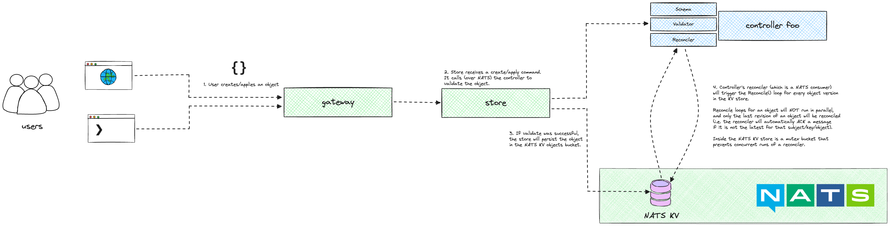

# Controllers

A controller in Horizon is serves a number of purposes:

1. Validates objects
2. Reconciles objects
3. Schema generator

## Validation

To create a validator simply implement the `hz.Validator` interface.
When starting a controller (e.g. `hz.StartController(...)`) pass in as many (or no) validators as you want.
As you code them in Go, feel free to use whatever means you find comfortable (e.g. just logic in Go or a library like [validator](https://github.com/go-playground/validator)).

The default validator uses [CUE](https://cuelang.org/).
When starting your controller, a CUE schema definition will be extracted from the object.
Hence if you see `cue:""` struct tags across this code base, this is their purpose!

You can disable the CUE validator if you want, just make sure you do implement something else to avoid bad data getting into the NATS KV.

### Validation using CUE

To add extra validation using CUE, you can add tags to your structs, e.g.

```go
type MyObject struct {
    hz.ObjectMeta `json:"metadata,omitempty" cue:""`

    Spec   *MyObjectSpec   `json:"spec,omitempty" cue:""`
    Status *MyObjectStatus `json:"status,omitempty" cue:""`

}

type MyObjectSpec struct {
    // Number is required, and CUE will automatically determine the type.
    Number int `json:"number,omitempty" cue:""`
    // Text is optional, and CUE will automatically determine the type.
    Text string `json:"text,omitempty" cue:",opt"`
    // Regexp is optiona, and CUE will make sure it matches the regex.
    Regexp string `json:"regexp,omitempty" cue:"=~\"^[a-zA-Z0-9-_]+$\""`
}
```

> [!NOTE]
> CUE is the gift that keeps on giving. It is so nice, but then such a pain at times.
>
> After spending many hours using its builtin Go parser, we resorted to building a custom struct parser for CUE to generate a CUE schema definition 🙈
>
> This works pretty well for now and has actually meant that we can add special conditions for custom Go types (like `time.Time`, `json.RawMessage`).

The basic syntax of a CUE struct tag is:

`cue:"<expr>[,opt]>"`

The `<expr>` will be parsed as a CUE [expression](https://cuelang.org/docs/tutorials/tour/expressions/), and `<opt>` can either be empty (required) or `,opt` (optional).

> [!TIP]
> Unless you know CUE well, or are interested to learn it, I would not try to do complex things with it.
> Basic field validation, sure.
> But anything more we would recommend just writing logic in Go to validate an object.

## Reconciliation

Reconciliation is arguably the most significant feature of Horizon, and it works very similarly to Kubernetes.

To create a reconciler simply implement the `hz.Reconciler` interface.

Under the hood, a reconciler is just a [NATS Consumer](https://docs.nats.io/nats-concepts/jetstream/consumers).

The NATS KV is just a glorified [NATS Stream](https://docs.nats.io/nats-concepts/jetstream/streams).

When you create or apply an object, you are actually adding a message onto a NATS stream.
The subject of the message is derived from the `hz.ObjectKeyer` interface (e.g. `group.version.kind.namespace.name`).

The reconciler then *consumes* messages from this stream.
The NATS consumer is [durable](https://docs.nats.io/using-nats/developer/develop_jetstream/consumers#durable-consumers), meaning you can run multiple instances of it and the messages will be distributed across the instances.

There are a few more features that a Horizon reconciler adds to make it more usable:

1. It only delivers the last message on a subject (you will not get old revisions of the object).
2. There will only be one concurrent reconcile loop for a given object. This is achieved using a NATS KV bucket which acts like a mutex.
3. You can watch child objects.
4. If your reconcile loops are long, Horizon will automatically mark your JetStream messages as `InProgress()`, meaning the NATS JetStream server will not re-deliver them, believing that the consumer has timed out (this is fairly advanced so you don't need to care about it, but it is there :)).

## Schema generation

A Horizon controller will generate an OpenAPI v3 schema for the object it controls.
This is not used for anything internal, but could be used for dynamic web form generation or something similar.
Under the hood, it uses CUE to generate the OpenAPI schema.

## Overview

Below is a high-level diagram to show how this fits together.


