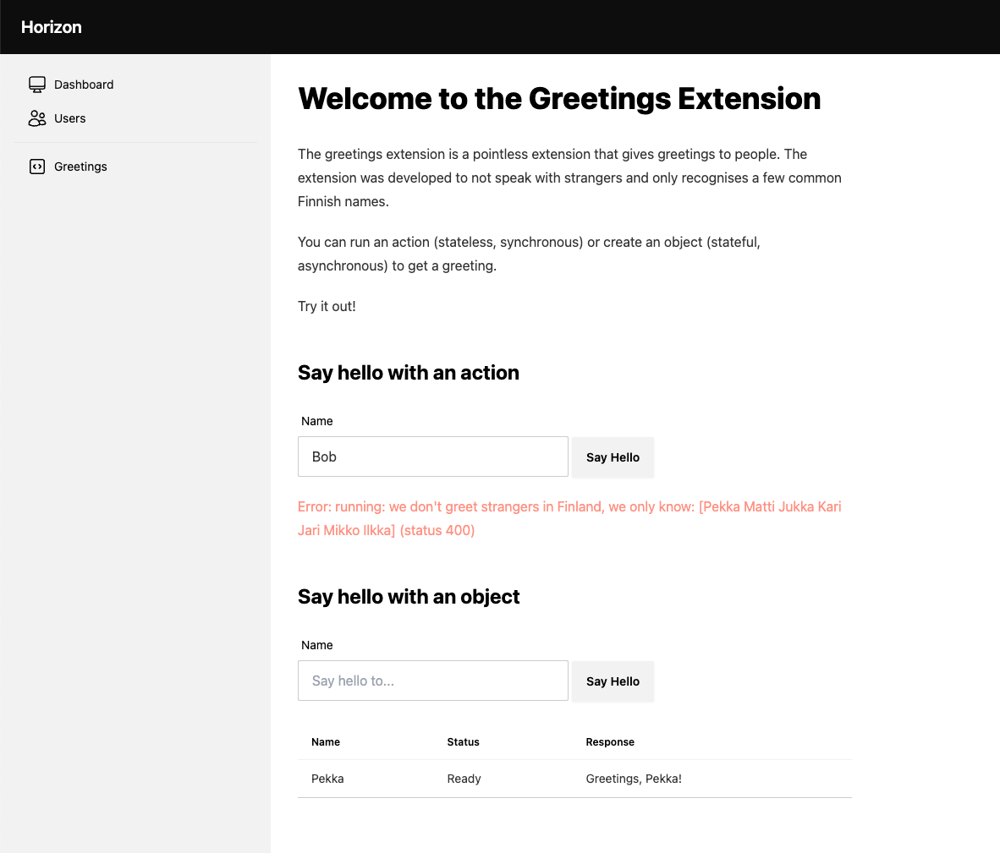

# Greetings

The greetings extension is a pointless extension that gives greetings to people.

The extension was developed to not speak with strangers and only recognises a few common Finnish names.

You can run an action (stateless, synchronous) or create an object (stateful, asynchronous) to get a greeting.

The example includes implementing:

1. A [controller](./controller.go) (with a `Reconciler` and `Validator`)
2. An [actor](./actor.go)
3. A [portal](./portal.go).

## Running the example

1. Run `make dev` to start the Horizon server in dev mode.
2. Copy the credentials that are output and save it to a file `nats.creds`.
3. Export the `nats.creds` for NATS to use it `export NATS_CREDS=./nats.creds`
4. Run the greetings extension: `go run ./examples/cmd/main.go`

Once you start the server and create a namespace you should see the "Greetings" portal on the left:

From there you can click around and greet some people.
